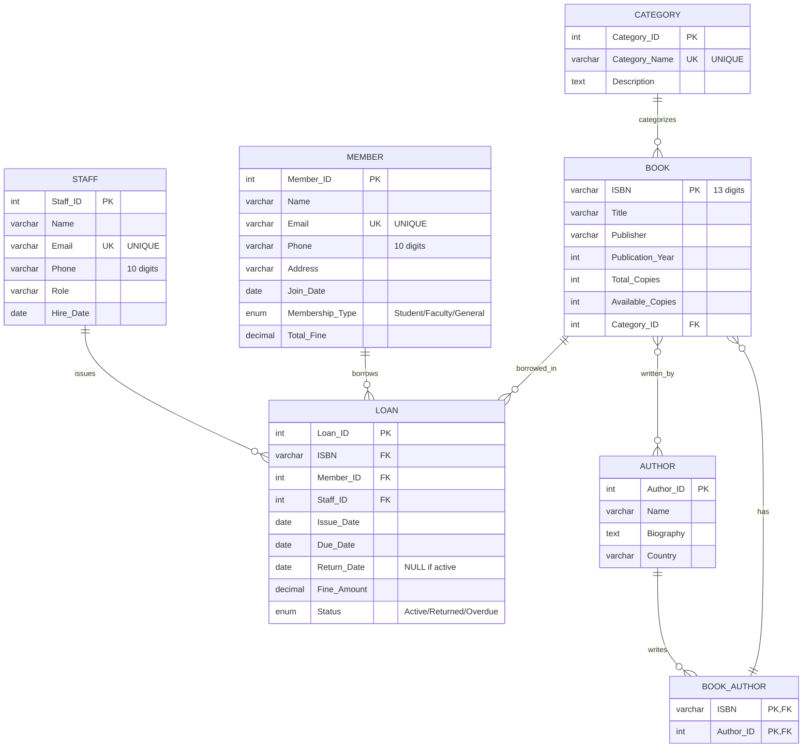

# Library Management System - ER Diagram

## Entity Relationship Diagram

### Mermaid Diagram (Render in GitHub, VS Code, or online tools)



---

## Detailed ER Diagram (Chen Notation - Text)

```
                                    ┌─────────────────┐
                                    │    CATEGORY     │
                                    ├─────────────────┤
                                    │ Category_ID (PK)│
                                    │ Category_Name   │
                                    │ Description     │
                                    └────────┬────────┘
                                             │
                                             │ 1
                                             │
                                        BELONGS_TO
                                             │
                                             │ N
                                    ┌────────┴────────┐
                                    │      BOOK       │
                                    ├─────────────────┤
                                    │ ISBN (PK)       │
                                    │ Title           │
                                    │ Publisher       │
                                    │ Publication_Year│
                                    │ Total_Copies    │
                                    │ Available_Copies│
                                    │ Category_ID (FK)│
                                    └────────┬────────┘
                                             │
                                             │ M
                                             │
                                       WRITTEN_BY
                                             │
                                             │ N
                    ┌────────────────────────┴────────────────────────┐
                    │                                                  │
           ┌────────┴────────┐                              ┌─────────┴────────┐
           │  BOOK_AUTHOR    │                              │     AUTHOR       │
           ├─────────────────┤                              ├──────────────────┤
           │ ISBN (PK,FK)    │                              │ Author_ID (PK)   │
           │ Author_ID (PK,FK)│                             │ Name             │
           └─────────────────┘                              │ Biography        │
                                                            │ Country          │
                                                            └──────────────────┘


    ┌─────────────────┐                                    ┌─────────────────┐
    │     MEMBER      │                                    │      STAFF      │
    ├─────────────────┤                                    ├─────────────────┤
    │ Member_ID (PK)  │                                    │ Staff_ID (PK)   │
    │ Name            │                                    │ Name            │
    │ Email           │                                    │ Email           │
    │ Phone           │                                    │ Phone           │
    │ Address         │                                    │ Role            │
    │ Join_Date       │                                    │ Hire_Date       │
    │ Membership_Type │                                    └────────┬────────┘
    │ Total_Fine      │                                             │
    └────────┬────────┘                                             │ 1
             │                                                       │
             │ 1                                                ISSUES
             │                                                       │
         BORROWS                                                     │ N
             │                                              ┌────────┴────────┐
             │ N                                            │                 │
    ┌────────┴────────┐                                    │                 │
    │      LOAN       │◄───────────────────────────────────┘                 │
    ├─────────────────┤                                                      │
    │ Loan_ID (PK)    │                                                      │
    │ ISBN (FK)       │◄─────────────────────────────────────────────────────┘
    │ Member_ID (FK)  │                                    (from BOOK)
    │ Staff_ID (FK)   │
    │ Issue_Date      │
    │ Due_Date        │
    │ Return_Date     │
    │ Fine_Amount     │
    │ Status          │
    └─────────────────┘
```

---

## Cardinality and Participation

### Relationships Summary

| Relationship | Entity 1 | Cardinality | Entity 2 | Participation |
|--------------|----------|-------------|----------|---------------|
| BELONGS_TO | BOOK | N:1 | CATEGORY | Total:Partial |
| WRITTEN_BY | BOOK | M:N | AUTHOR | Total:Partial |
| BORROWED_IN | BOOK | 1:N | LOAN | Partial:Total |
| BORROWS | MEMBER | 1:N | LOAN | Partial:Total |
| ISSUES | STAFF | 1:N | LOAN | Partial:Total |

### Detailed Relationship Descriptions

#### 1. BOOK BELONGS_TO CATEGORY (N:1)
- **Cardinality:** Many books belong to one category
- **Participation:** 
  - BOOK: Total (every book must have a category)
  - CATEGORY: Partial (a category may have no books)
- **Implementation:** Category_ID as FK in BOOK table

#### 2. BOOK WRITTEN_BY AUTHOR (M:N)
- **Cardinality:** Many books can have many authors
- **Participation:**
  - BOOK: Total (every book must have at least one author)
  - AUTHOR: Partial (an author may not have books in library)
- **Implementation:** Junction table BOOK_AUTHOR

#### 3. BOOK BORROWED_IN LOAN (1:N)
- **Cardinality:** One book can be in many loan records
- **Participation:**
  - BOOK: Partial (a book may never be borrowed)
  - LOAN: Total (every loan must reference a book)
- **Implementation:** ISBN as FK in LOAN table

#### 4. MEMBER BORROWS LOAN (1:N)
- **Cardinality:** One member can have many loans
- **Participation:**
  - MEMBER: Partial (a member may never borrow)
  - LOAN: Total (every loan must have a member)
- **Implementation:** Member_ID as FK in LOAN table

#### 5. STAFF ISSUES LOAN (1:N)
- **Cardinality:** One staff member can issue many loans
- **Participation:**
  - STAFF: Partial (staff may not have issued any loans)
  - LOAN: Total (every loan must be issued by staff)
- **Implementation:** Staff_ID as FK in LOAN table

---

## Attributes Details

### Primary Keys (PK)
- **CATEGORY:** Category_ID (Auto-increment)
- **AUTHOR:** Author_ID (Auto-increment)
- **BOOK:** ISBN (13-digit unique identifier)
- **BOOK_AUTHOR:** (ISBN, Author_ID) - Composite key
- **MEMBER:** Member_ID (Auto-increment)
- **STAFF:** Staff_ID (Auto-increment)
- **LOAN:** Loan_ID (Auto-increment)

### Foreign Keys (FK)
- **BOOK.Category_ID** → CATEGORY.Category_ID
- **BOOK_AUTHOR.ISBN** → BOOK.ISBN
- **BOOK_AUTHOR.Author_ID** → AUTHOR.Author_ID
- **LOAN.ISBN** → BOOK.ISBN
- **LOAN.Member_ID** → MEMBER.Member_ID
- **LOAN.Staff_ID** → STAFF.Staff_ID

### Unique Constraints (UK)
- CATEGORY.Category_Name
- MEMBER.Email
- STAFF.Email

### Derived Attributes
- **LOAN.Status** - Can be derived from:
  - If Return_Date IS NULL AND Due_Date < TODAY → 'Overdue'
  - If Return_Date IS NULL AND Due_Date >= TODAY → 'Active'
  - If Return_Date IS NOT NULL → 'Returned'

### Multi-valued Attributes
- None (handled through relationships)
- Authors for a book: Handled via BOOK_AUTHOR junction table

---

## Constraints Summary

### Domain Constraints
- ISBN: VARCHAR(13) - exactly 13 digits
- Email: Valid email format
- Phone: VARCHAR(10) - exactly 10 digits
- Membership_Type: ENUM('Student', 'Faculty', 'General')
- Status: ENUM('Active', 'Returned', 'Overdue')
- Fine_Amount: DECIMAL(10,2) >= 0 AND <= 1000
- Available_Copies: >= 0 AND <= Total_Copies

### Referential Integrity
- ON DELETE RESTRICT for LOAN foreign keys (preserve history)
- ON DELETE CASCADE for BOOK_AUTHOR (remove associations)
- ON UPDATE CASCADE for all foreign keys

### Business Rules
1. Available_Copies cannot exceed Total_Copies
2. Due_Date must be after Issue_Date
3. Return_Date must be after or equal to Issue_Date
4. Member can borrow max 3 books simultaneously
5. Member cannot borrow if Total_Fine > ₹500
6. Fine calculation based on Membership_Type:
   - Student: ₹5/day
   - Faculty: ₹3/day
   - General: ₹10/day

---

## How to View This Diagram

### Option 1: GitHub
- Push this file to GitHub
- GitHub automatically renders Mermaid diagrams

### Option 2: VS Code
- Install "Markdown Preview Mermaid Support" extension
- Open this file and preview (Ctrl+Shift+V)

### Option 3: Online Tools
- Copy the Mermaid code to: https://mermaid.live/
- Or use: https://mermaid.ink/

### Option 4: Draw.io / Lucidchart
- Use the text descriptions above to manually create the diagram
- Import/export as needed

---

## Visual Legend

```
┌─────────────┐
│   ENTITY    │  = Strong Entity
├─────────────┤
│ Attribute   │
└─────────────┘

PK  = Primary Key
FK  = Foreign Key
UK  = Unique Key

──── = Relationship Line
1    = One (cardinality)
N    = Many (cardinality)
M:N  = Many-to-Many
```

---

**Note:** The Mermaid diagram at the top provides an interactive, auto-rendered visualization. The text-based diagrams provide detailed structural information for documentation purposes.
