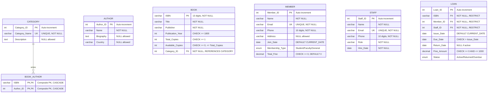

# Library Management System - ER Diagram

## 1. Entity Identification and Classification

### Strong Entities (7 entities)
All entities in this system are **strong entities** with independent existence:

1. **CATEGORY** - Book classification categories
2. **AUTHOR** - Book authors/writers  
3. **BOOK** - Library book inventory
4. **MEMBER** - Library members/patrons
5. **STAFF** - Library staff/employees
6. **LOAN** - Book lending transactions
7. **BOOK_AUTHOR** - Junction entity for many-to-many relationship

**Note on Weak Entities**: This system has **NO weak entities**. All entities have:
- Independent existence (can exist without other entities)
- Their own primary keys (not dependent on other entities)
- Complete identification without partial keys

---

## 2. Entity Relationship Diagram

### Mermaid Diagram (Render in GitHub, VS Code, or online tools)

```mermaid
erDiagram
    CATEGORY ||--o{ BOOK_AUTHOR : "writes"

    CATEGORY {
        int Category_ID PK "Auto-increment"
        varchar Category_Name UK "UNIQUE, NOT NULL"
        text Description "NULL allowed"
    }

    AUTHOR {
        int Author_ID PK "Auto-increment"
        varchar Name "NOT NULL"
        text Biography "NULL allowed"
        varchar Country "NULL allowed"
    }

    BOOK {
        varchar ISBN PK "13 digits, NOT NULL"
        varchar Title "NOT NULL"
        varchar Publisher "NOT NULL"
        int Publication_Year "CHECK >= 1800"
        int Total_Copies "CHECK >= 1"
        int Available_Copies "CHECK >= 0, <= Total_Copies"
        int Category_ID FK "NOT NULL, REFERENCES CATEGORY"
    }

    BOOK_AUTHOR {
        varchar ISBN PK,FK "Composite PK, CASCADE"
        int Author_ID PK,FK "Composite PK, CASCADE"
    }

    MEMBER {
        int Member_ID PK "Auto-increment"
        varchar Name "NOT NULL"
        varchar Email UK "UNIQUE, NOT NULL"
        varchar Phone "10 digits, NOT NULL"
        varchar Address "NULL allowed"
        date Join_Date "DEFAULT CURRENT_DATE"
        enum Membership_Type "Student/Faculty/General"
        decimal Total_Fine "CHECK >= 0, DEFAULT 0"
    }

    STAFF {
        int Staff_ID PK "Auto-increment"
        varchar Name "NOT NULL"
        varchar Email UK "UNIQUE, NOT NULL"
        varchar Phone "10 digits, NOT NULL"
        varchar Role "NOT NULL"
        date Hire_Date "NOT NULL"
    }

    LOAN {
        int Loan_ID PK "Auto-increment"
        varchar ISBN FK "NOT NULL, RESTRICT"
        int Member_ID FK "NOT NULL, RESTRICT"
        int Staff_ID FK "NOT NULL, RESTRICT"
        date Issue_Date "DEFAULT CURRENT_DATE"
        date Due_Date "CHECK > Issue_Date"
        date Return_Date "NULL if active"
        decimal Fine_Amount "CHECK >= 0 AND <= 1000"
        enum Status "Active/Returned/Overdue"
    }
```

---

## 3. Relationship Specifications with Cardinality and Participation

### Relationship 1: BOOK BELONGS_TO CATEGORY
**Relationship Type**: Many-to-One (N:1)

**Cardinality**: 
- BOOK side: Many (N) - Multiple books can belong to one category
- CATEGORY side: One (1) - Each book belongs to exactly one category

**Participation Constraints**:
- BOOK: **Total (Mandatory)** - Every book MUST belong to a category
- CATEGORY: **Partial (Optional)** - A category may exist without books

**Implementation**: Foreign Key Category_ID in BOOK table
**Referential Integrity**: ON DELETE RESTRICT (cannot delete category with books)

---

### Relationship 2: BOOK WRITTEN_BY AUTHOR
**Relationship Type**: Many-to-Many (M:N)

**Cardinality**:
- BOOK side: Many (M) - A book can have multiple authors
- AUTHOR side: Many (N) - An author can write multiple books

**Participation Constraints**:
- BOOK: **Total (Mandatory)** - Every book MUST have at least one author
- AUTHOR: **Partial (Optional)** - An author may not have books in this library

**Implementation**: Junction table BOOK_AUTHOR with composite primary key (ISBN, Author_ID)
**Referential Integrity**: ON DELETE CASCADE (if book or author deleted, remove association)

---

### Relationship 3: BOOK BORROWED_IN LOAN
**Relationship Type**: One-to-Many (1:N)

**Cardinality**:
- BOOK side: One (1) - Each loan record references one book
- LOAN side: Many (N) - A book can appear in multiple loan records

**Participation Constraints**:
- BOOK: **Partial (Optional)** - A book may never be borrowed
- LOAN: **Total (Mandatory)** - Every loan MUST reference a book

**Implementation**: Foreign Key ISBN in LOAN table
**Referential Integrity**: ON DELETE RESTRICT (cannot delete book with loan history)

---

### Relationship 4: MEMBER BORROWS LOAN
**Relationship Type**: One-to-Many (1:N)

**Cardinality**:
- MEMBER side: One (1) - Each loan is associated with one member
- LOAN side: Many (N) - A member can have multiple loans

**Participation Constraints**:
- MEMBER: **Partial (Optional)** - A member may never borrow books
- LOAN: **Total (Mandatory)** - Every loan MUST be associated with a member

**Implementation**: Foreign Key Member_ID in LOAN table
**Referential Integrity**: ON DELETE RESTRICT (cannot delete member with loan history)

---

### Relationship 5: STAFF ISSUES LOAN
**Relationship Type**: One-to-Many (1:N)

**Cardinality**:
- STAFF side: One (1) - Each loan is processed by one staff member
- LOAN side: Many (N) - A staff member can process multiple loans

**Participation Constraints**:
- STAFF: **Partial (Optional)** - A staff member may not have processed any loans yet
- LOAN: **Total (Mandatory)** - Every loan MUST be issued by a staff member

**Implementation**: Foreign Key Staff_ID in LOAN table
**Referential Integrity**: ON DELETE RESTRICT (cannot delete staff with transaction history)

---

## 4. Cardinality and Participation Summary Table

| Relationship | Entity 1 | Cardinality | Entity 2 | Participation (E1:E2) | Implementation |
|--------------|----------|-------------|----------|----------------------|----------------|
| BELONGS_TO | BOOK | N:1 | CATEGORY | Total:Partial | FK in BOOK |
| WRITTEN_BY | BOOK | M:N | AUTHOR | Total:Partial | Junction table BOOK_AUTHOR |
| BORROWED_IN | BOOK | 1:N | LOAN | Partial:Total | FK in LOAN |
| BORROWS | MEMBER | 1:N | LOAN | Partial:Total | FK in LOAN |
| ISSUES | STAFF | 1:N | LOAN | Partial:Total | FK in LOAN |

**Legend**:
- **Total Participation** (Mandatory): Every instance must participate (double line in ER diagram)
- **Partial Participation** (Optional): Instance may or may not participate (single line in ER diagram)
- **1**: Exactly one
- **N**: Many (zero or more)
- **M:N**: Many-to-many

---

## 5. Integrity Constraints Summary

### Domain Constraints
- ISBN: Exactly 13 digits
- Email: Valid email format, unique
- Phone: Exactly 10 digits
- Membership_Type: ENUM('Student', 'Faculty', 'General')
- Status: ENUM('Active', 'Returned', 'Overdue')
- Publication_Year: >= 1800 AND <= current year
- Total_Copies: >= 1
- Available_Copies: >= 0 AND <= Total_Copies
- Fine_Amount: >= 0 AND <= 1000
- Total_Fine: >= 0

### Key Constraints

**Primary Keys**:
- CATEGORY(Category_ID)
- AUTHOR(Author_ID)
- BOOK(ISBN)
- BOOK_AUTHOR(ISBN, Author_ID) - Composite
- MEMBER(Member_ID)
- STAFF(Staff_ID)
- LOAN(Loan_ID)

**Candidate Keys** (Unique Constraints):
- CATEGORY(Category_Name)
- MEMBER(Email)
- STAFF(Email)

**Foreign Keys**:
- BOOK.Category_ID → CATEGORY.Category_ID
- BOOK_AUTHOR.ISBN → BOOK.ISBN
- BOOK_AUTHOR.Author_ID → AUTHOR.Author_ID
- LOAN.ISBN → BOOK.ISBN
- LOAN.Member_ID → MEMBER.Member_ID
- LOAN.Staff_ID → STAFF.Staff_ID

### Referential Integrity Constraints
- **CASCADE**: BOOK_AUTHOR foreign keys (delete associations when book/author deleted)
- **RESTRICT**: LOAN foreign keys (preserve transaction history)
- **RESTRICT**: BOOK.Category_ID (cannot delete category with books)

### Entity Integrity Constraints
- All primary keys are NOT NULL
- All primary keys are UNIQUE
- No partial NULL values in composite keys

### Semantic/Business Constraints
- Available_Copies <= Total_Copies
- Due_Date > Issue_Date
- Return_Date >= Issue_Date (if not NULL)
- Member cannot borrow if Total_Fine > ₹500
- Member cannot borrow if they have overdue books
- Member cannot borrow more than 3 books simultaneously
- Book cannot be issued if Available_Copies = 0

---

## 6. Weak Entity Analysis

**Conclusion**: This database design contains **NO weak entities**.

**Justification**:
1. All entities have their own primary keys that uniquely identify them
2. No entity depends on another entity for its identification
3. No partial keys are required
4. All entities can exist independently

**Potential Weak Entity Consideration**:
- **BOOK_AUTHOR** might appear to be weak, but it is actually a **strong associative entity** because:
  - It has a composite primary key (ISBN, Author_ID)
  - Both components are foreign keys, but together they form a complete primary key
  - It represents a relationship with attributes (if any were added)
  - It can be independently queried and managed

**Why LOAN is NOT a weak entity**:
- LOAN has its own surrogate primary key (Loan_ID)
- It does not depend on BOOK, MEMBER, or STAFF for identification
- It can exist and be identified independently
- Foreign keys are for referential integrity, not identification

---

## 7. How to View This Diagram

### Option 1: GitHub
- Push this file to GitHub
- GitHub automatically renders Mermaid diagrams

### Option 2: VS Code
- Install "Markdown Preview Mermaid Support" extension
- Open this file and preview (Ctrl+Shift+V)

### Option 3: Online Tools
- Copy the Mermaid code to: https://mermaid.live/
- Or use: https://mermaid.ink/

### Option 4: Draw.io / Lucidchart
- Use the specifications above to manually create the diagram
- Import/export as needed

---

**Note:** The Mermaid diagram provides an interactive, auto-rendered visualization with all constraints, cardinalities, and participation clearly marked.

