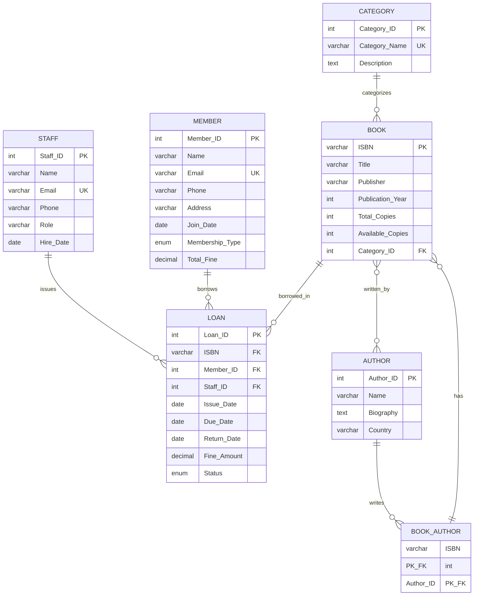

# Library Management System - Final Project Report
Group members-
Aarati Dhamele 2023B1A70641H
Shreya Bhaskar 2023B4A70970H
Sudhansh Pilla 2023B4A70953H
Yash Kejriwal 2023B4A70770H
Parth Sureka 2023B4A70753H
Kotra Keshav Gupta 2023A7PS0534P

## Table of Contents
1. [Problem Description and Assumptions](#1-problem-description-and-assumptions)
2. [ER Diagram and Schema Design](#2-er-diagram-and-schema-design)
3. [Constraint Specifications](#3-constraint-specifications)
4. [Front-End Interface Description](#4-front-end-interface-description)

---

## 1. Problem Description and Assumptions

### 1.1 Problem Statement

The Library Management System is designed to automate and streamline library operations for educational institutions. The system manages:
- Book inventory and cataloging
- Member registration and management
- Book lending and return processes
- Fine calculation and tracking
- Staff operations and transaction logging

### 1.2 System Objectives

1. **Efficient Book Management**: Track book availability, copies, and categorization
2. **Member Management**: Maintain member records with different membership types
3. **Loan Processing**: Automate book issuing and returning with due date tracking
4. **Fine Calculation**: Automatic calculation based on membership type and overdue days
5. **Reporting**: Generate statistics and reports for library operations

### 1.3 Key Assumptions

#### Book Management Assumptions
- Each book is uniquely identified by a 13-digit ISBN
- A book can have multiple authors (co-authorship supported)
- Each book belongs to exactly one category
- Library maintains multiple physical copies of the same book
- Books can only be borrowed when available copies > 0

#### Member Management Assumptions
- Three membership types exist: Student, Faculty, and General
- Each member has a unique email address
- Members can borrow a maximum of 3 books simultaneously
- Members cannot borrow new books if they have:
  - Any overdue books
  - Unpaid fines exceeding ₹500

#### Loan Period and Fine Structure
| Membership Type | Loan Period | Fine Rate (per day) |
|----------------|-------------|---------------------|
| Student        | 14 days     | ₹5                  |
| Faculty        | 30 days     | ₹3                  |
| General        | 7 days      | ₹10                 |

#### Transaction Assumptions
- All book issues and returns must be processed by authorized staff
- Each transaction is logged with staff member details
- Return date is NULL for active loans
- Fine is calculated only after the due date
- Maximum fine per book is capped at ₹1000
- Books cannot be deleted if they have loan history (data integrity)

#### System Constraints
- System operates in a single library location
- All dates are in YYYY-MM-DD format
- Phone numbers are 10-digit Indian format
- Email addresses must be unique across members and staff
- ISBN must be exactly 13 digits

---

## 2. ER Diagram and Schema Design

### 2.1 Entity Identification and Classification

#### Strong Entities (7 entities)
All entities in this system are **strong entities** with independent existence:

1. **CATEGORY** - Book classification categories
2. **AUTHOR** - Book authors/writers
3. **BOOK** - Library book inventory
4. **MEMBER** - Library members/patrons
5. **STAFF** - Library staff/employees
6. **LOAN** - Book lending transactions
7. **BOOK_AUTHOR** - Junction entity for many-to-many relationship

**Note on Weak Entities**: This system has NO weak entities. All entities have:
- Independent existence (can exist without other entities)
- Their own primary keys (not dependent on other entities)
- Complete identification without partial keys

### 2.2 Entity Relationship Diagram



### 2.3 Complete Entity Attribute Specifications

#### Entity 1: CATEGORY
**Entity Type**: Strong Entity
**Primary Key**: Category_ID (surrogate key, auto-increment)
**Attributes**:
- Category_ID: INT, NOT NULL, AUTO_INCREMENT, PRIMARY KEY
- Category_Name: VARCHAR(50), NOT NULL, UNIQUE (candidate key)
- Description: TEXT, NULL

**Integrity Constraints**:
- Primary Key: Category_ID must be unique and not null
- Unique Constraint: Category_Name must be unique
- Domain Constraint: Category_Name length > 0

---

#### Entity 2: AUTHOR
**Entity Type**: Strong Entity
**Primary Key**: Author_ID (surrogate key, auto-increment)
**Attributes**:
- Author_ID: INT, NOT NULL, AUTO_INCREMENT, PRIMARY KEY
- Name: VARCHAR(100), NOT NULL
- Biography: TEXT, NULL (optional)
- Country: VARCHAR(50), NULL (optional)

**Integrity Constraints**:
- Primary Key: Author_ID must be unique and not null
- Domain Constraint: Name must not be empty

---

#### Entity 3: BOOK
**Entity Type**: Strong Entity
**Primary Key**: ISBN (natural key)
**Attributes**:
- ISBN: VARCHAR(13), NOT NULL, PRIMARY KEY (exactly 13 digits)
- Title: VARCHAR(200), NOT NULL
- Publisher: VARCHAR(100), NOT NULL
- Publication_Year: INT, NOT NULL, CHECK (>= 1800 AND <= current year)
- Total_Copies: INT, NOT NULL, CHECK (>= 1)
- Available_Copies: INT, NOT NULL, CHECK (>= 0)
- Category_ID: INT, NOT NULL, FOREIGN KEY

**Integrity Constraints**:
- Primary Key: ISBN must be unique and not null
- Foreign Key: Category_ID REFERENCES CATEGORY(Category_ID)
- Check Constraint: Available_Copies <= Total_Copies
- Check Constraint: Available_Copies >= 0
- Domain Constraint: ISBN must be exactly 13 digits

---

#### Entity 4: BOOK_AUTHOR (Junction Entity)
**Entity Type**: Strong Entity (Associative Entity)
**Primary Key**: (ISBN, Author_ID) - Composite Key
**Attributes**:
- ISBN: VARCHAR(13), NOT NULL, PRIMARY KEY, FOREIGN KEY
- Author_ID: INT, NOT NULL, PRIMARY KEY, FOREIGN KEY

**Integrity Constraints**:
- Composite Primary Key: (ISBN, Author_ID) must be unique
- Foreign Key: ISBN REFERENCES BOOK(ISBN) ON DELETE CASCADE
- Foreign Key: Author_ID REFERENCES AUTHOR(Author_ID) ON DELETE CASCADE

**Purpose**: Resolves many-to-many relationship between BOOK and AUTHOR

---

#### Entity 5: MEMBER
**Entity Type**: Strong Entity
**Primary Key**: Member_ID (surrogate key, auto-increment)
**Attributes**:
- Member_ID: INT, NOT NULL, AUTO_INCREMENT, PRIMARY KEY
- Name: VARCHAR(100), NOT NULL
- Email: VARCHAR(100), NOT NULL, UNIQUE (candidate key)
- Phone: VARCHAR(10), NOT NULL (exactly 10 digits)
- Address: VARCHAR(200), NULL (optional)
- Join_Date: DATE, NOT NULL, DEFAULT CURRENT_DATE
- Membership_Type: ENUM('Student', 'Faculty', 'General'), NOT NULL
- Total_Fine: DECIMAL(10,2), NOT NULL, DEFAULT 0, CHECK (>= 0)

**Integrity Constraints**:
- Primary Key: Member_ID must be unique and not null
- Unique Constraint: Email must be unique (candidate key)
- Domain Constraint: Phone must be exactly 10 digits
- Domain Constraint: Membership_Type must be one of three values
- Check Constraint: Total_Fine >= 0

---

#### Entity 6: STAFF
**Entity Type**: Strong Entity
**Primary Key**: Staff_ID (surrogate key, auto-increment)
**Attributes**:
- Staff_ID: INT, NOT NULL, AUTO_INCREMENT, PRIMARY KEY
- Name: VARCHAR(100), NOT NULL
- Email: VARCHAR(100), NOT NULL, UNIQUE (candidate key)
- Phone: VARCHAR(10), NOT NULL
- Role: VARCHAR(50), NOT NULL
- Hire_Date: DATE, NOT NULL

**Integrity Constraints**:
- Primary Key: Staff_ID must be unique and not null
- Unique Constraint: Email must be unique (candidate key)
- Domain Constraint: All fields except email are required

---

#### Entity 7: LOAN
**Entity Type**: Strong Entity
**Primary Key**: Loan_ID (surrogate key, auto-increment)
**Attributes**:
- Loan_ID: INT, NOT NULL, AUTO_INCREMENT, PRIMARY KEY
- ISBN: VARCHAR(13), NOT NULL, FOREIGN KEY
- Member_ID: INT, NOT NULL, FOREIGN KEY
- Staff_ID: INT, NOT NULL, FOREIGN KEY
- Issue_Date: DATE, NOT NULL, DEFAULT CURRENT_DATE
- Due_Date: DATE, NOT NULL
- Return_Date: DATE, NULL (NULL indicates active loan)
- Fine_Amount: DECIMAL(10,2), NOT NULL, DEFAULT 0, CHECK (>= 0 AND <= 1000)
- Status: ENUM('Active', 'Returned', 'Overdue'), NOT NULL

**Integrity Constraints**:
- Primary Key: Loan_ID must be unique and not null
- Foreign Key: ISBN REFERENCES BOOK(ISBN) ON DELETE RESTRICT
- Foreign Key: Member_ID REFERENCES MEMBER(Member_ID) ON DELETE RESTRICT
- Foreign Key: Staff_ID REFERENCES STAFF(Staff_ID) ON DELETE RESTRICT
- Check Constraint: Due_Date > Issue_Date
- Check Constraint: Return_Date >= Issue_Date (if not NULL)
- Check Constraint: Fine_Amount >= 0 AND Fine_Amount <= 1000
- Domain Constraint: Status must be one of three values

---

### 2.4 Relationship Specifications with Cardinality and Participation

#### Relationship 1: BOOK BELONGS_TO CATEGORY
**Relationship Type**: Many-to-One (N:1)
**Cardinality**: 
- BOOK side: Many (N) - Multiple books can belong to one category
- CATEGORY side: One (1) - Each book belongs to exactly one category

**Participation Constraints**:
- BOOK: **Total (Mandatory)** - Every book MUST belong to a category
- CATEGORY: **Partial (Optional)** - A category may exist without books

**Implementation**: Foreign Key Category_ID in BOOK table
**Referential Integrity**: ON DELETE RESTRICT (cannot delete category with books)

---

#### Relationship 2: BOOK WRITTEN_BY AUTHOR
**Relationship Type**: Many-to-Many (M:N)
**Cardinality**:
- BOOK side: Many (M) - A book can have multiple authors
- AUTHOR side: Many (N) - An author can write multiple books

**Participation Constraints**:
- BOOK: **Total (Mandatory)** - Every book MUST have at least one author
- AUTHOR: **Partial (Optional)** - An author may not have books in this library

**Implementation**: Junction table BOOK_AUTHOR with composite primary key (ISBN, Author_ID)
**Referential Integrity**: ON DELETE CASCADE (if book or author deleted, remove association)

---

#### Relationship 3: BOOK BORROWED_IN LOAN
**Relationship Type**: One-to-Many (1:N)
**Cardinality**:
- BOOK side: One (1) - Each loan record references one book
- LOAN side: Many (N) - A book can appear in multiple loan records

**Participation Constraints**:
- BOOK: **Partial (Optional)** - A book may never be borrowed
- LOAN: **Total (Mandatory)** - Every loan MUST reference a book

**Implementation**: Foreign Key ISBN in LOAN table
**Referential Integrity**: ON DELETE RESTRICT (cannot delete book with loan history)

---

#### Relationship 4: MEMBER BORROWS LOAN
**Relationship Type**: One-to-Many (1:N)
**Cardinality**:
- MEMBER side: One (1) - Each loan is associated with one member
- LOAN side: Many (N) - A member can have multiple loans

**Participation Constraints**:
- MEMBER: **Partial (Optional)** - A member may never borrow books
- LOAN: **Total (Mandatory)** - Every loan MUST be associated with a member

**Implementation**: Foreign Key Member_ID in LOAN table
**Referential Integrity**: ON DELETE RESTRICT (cannot delete member with loan history)

---

#### Relationship 5: STAFF ISSUES LOAN
**Relationship Type**: One-to-Many (1:N)
**Cardinality**:
- STAFF side: One (1) - Each loan is processed by one staff member
- LOAN side: Many (N) - A staff member can process multiple loans

**Participation Constraints**:
- STAFF: **Partial (Optional)** - A staff member may not have processed any loans yet
- LOAN: **Total (Mandatory)** - Every loan MUST be issued by a staff member

**Implementation**: Foreign Key Staff_ID in LOAN table
**Referential Integrity**: ON DELETE RESTRICT (cannot delete staff with transaction history)

---

### 2.5 Integrity Constraints Summary

#### 1. Domain Constraints
- ISBN: Exactly 13 digits
- Email: Valid email format, unique
- Phone: Exactly 10 digits
- Membership_Type: ENUM('Student', 'Faculty', 'General')
- Status: ENUM('Active', 'Returned', 'Overdue')
- Publication_Year: >= 1800 AND <= current year
- Total_Copies: >= 1
- Available_Copies: >= 0 AND <= Total_Copies
- Fine_Amount: >= 0 AND <= 1000
- Total_Fine: >= 0

#### 2. Key Constraints
**Primary Keys**:
- CATEGORY(Category_ID)
- AUTHOR(Author_ID)
- BOOK(ISBN)
- BOOK_AUTHOR(ISBN, Author_ID) - Composite
- MEMBER(Member_ID)
- STAFF(Staff_ID)
- LOAN(Loan_ID)

**Candidate Keys** (Unique Constraints):
- CATEGORY(Category_Name)
- MEMBER(Email)
- STAFF(Email)

**Foreign Keys**:
- BOOK.Category_ID → CATEGORY.Category_ID
- BOOK_AUTHOR.ISBN → BOOK.ISBN
- BOOK_AUTHOR.Author_ID → AUTHOR.Author_ID
- LOAN.ISBN → BOOK.ISBN
- LOAN.Member_ID → MEMBER.Member_ID
- LOAN.Staff_ID → STAFF.Staff_ID

#### 3. Referential Integrity Constraints
- **CASCADE**: BOOK_AUTHOR foreign keys (delete associations when book/author deleted)
- **RESTRICT**: LOAN foreign keys (preserve transaction history)
- **RESTRICT**: BOOK.Category_ID (cannot delete category with books)

#### 4. Entity Integrity Constraints
- All primary keys are NOT NULL
- All primary keys are UNIQUE
- No partial NULL values in composite keys

#### 5. Semantic/Business Constraints
- Available_Copies <= Total_Copies
- Due_Date > Issue_Date
- Return_Date >= Issue_Date (if not NULL)
- Member cannot borrow if Total_Fine > ₹500
- Member cannot borrow if they have overdue books
- Member cannot borrow more than 3 books simultaneously
- Book cannot be issued if Available_Copies = 0

---

### 2.6 Relational Schema

#### Table 1: CATEGORY
```sql
CATEGORY(Category_ID, Category_Name, Description)
  Primary Key: Category_ID
  Unique: Category_Name
```

**Purpose**: Categorizes books into genres (Fiction, Science, History, etc.)

#### Table 2: AUTHOR
```sql
AUTHOR(Author_ID, Name, Biography, Country)
  Primary Key: Author_ID
```

**Purpose**: Stores author information for books

#### Table 3: BOOK
```sql
BOOK(ISBN, Title, Publisher, Publication_Year, Total_Copies, Available_Copies, Category_ID)
  Primary Key: ISBN
  Foreign Key: Category_ID REFERENCES CATEGORY(Category_ID)
```

**Purpose**: Main book inventory with availability tracking

#### Table 4: BOOK_AUTHOR (Junction Table)
```sql
BOOK_AUTHOR(ISBN, Author_ID)
  Primary Key: (ISBN, Author_ID)
  Foreign Key: ISBN REFERENCES BOOK(ISBN) ON DELETE CASCADE
  Foreign Key: Author_ID REFERENCES AUTHOR(Author_ID) ON DELETE CASCADE
```

**Purpose**: Implements many-to-many relationship between books and authors

#### Table 5: MEMBER
```sql
MEMBER(Member_ID, Name, Email, Phone, Address, Join_Date, Membership_Type, Total_Fine)
  Primary Key: Member_ID
  Unique: Email
```

**Purpose**: Stores library member information and fine tracking

#### Table 6: STAFF
```sql
STAFF(Staff_ID, Name, Email, Phone, Role, Hire_Date)
  Primary Key: Staff_ID
  Unique: Email
```

**Purpose**: Maintains staff records for transaction logging

#### Table 7: LOAN
```sql
LOAN(Loan_ID, ISBN, Member_ID, Staff_ID, Issue_Date, Due_Date, Return_Date, Fine_Amount, Status)
  Primary Key: Loan_ID
  Foreign Key: ISBN REFERENCES BOOK(ISBN)
  Foreign Key: Member_ID REFERENCES MEMBER(Member_ID)
  Foreign Key: Staff_ID REFERENCES STAFF(Staff_ID)
```

**Purpose**: Records all book lending transactions

### 2.7 Relationship Cardinality Summary Table

| Relationship | Entity 1 | Cardinality | Entity 2 | Participation (E1:E2) | Implementation |
|--------------|----------|-------------|----------|----------------------|----------------|
| BELONGS_TO | BOOK | N:1 | CATEGORY | Total:Partial | FK in BOOK |
| WRITTEN_BY | BOOK | M:N | AUTHOR | Total:Partial | Junction table BOOK_AUTHOR |
| BORROWED_IN | BOOK | 1:N | LOAN | Partial:Total | FK in LOAN |
| BORROWS | MEMBER | 1:N | LOAN | Partial:Total | FK in LOAN |
| ISSUES | STAFF | 1:N | LOAN | Partial:Total | FK in LOAN |

**Legend**:
- **Total Participation** (Mandatory): Every instance must participate (double line in ER diagram)
- **Partial Participation** (Optional): Instance may or may not participate (single line in ER diagram)
- **1**: Exactly one
- **N**: Many (zero or more)
- **M:N**: Many-to-many

---

### 2.8 Weak Entity Analysis

**Conclusion**: This database design contains **NO weak entities**.

**Justification**:
1. All entities have their own primary keys that uniquely identify them
2. No entity depends on another entity for its identification
3. No partial keys are required
4. All entities can exist independently

**Potential Weak Entity Consideration**:
- **BOOK_AUTHOR** might appear to be weak, but it is actually a **strong associative entity** because:
  - It has a composite primary key (ISBN, Author_ID)
  - Both components are foreign keys, but together they form a complete primary key
  - It represents a relationship with attributes (if any were added)
  - It can be independently queried and managed

**Why LOAN is NOT a weak entity**:
- LOAN has its own surrogate primary key (Loan_ID)
- It does not depend on BOOK, MEMBER, or STAFF for identification
- It can exist and be identified independently
- Foreign keys are for referential integrity, not identification

---

### 2.9 Normalization Analysis

**First Normal Form (1NF)**: ✅
- All attributes contain atomic values
- No repeating groups
- Each table has a primary key

**Second Normal Form (2NF)**: ✅
- All tables are in 1NF
- No partial dependencies (all non-key attributes depend on entire primary key)

**Third Normal Form (3NF)**: ✅
- All tables are in 2NF
- No transitive dependencies

**Boyce-Codd Normal Form (BCNF)**: ✅
- All tables are in 3NF
- For every functional dependency X → Y, X is a superkey

**Conclusion**: The database schema is fully normalized to BCNF, ensuring minimal redundancy and maximum data integrity.

---

## 3. Constraint Specifications

### 3.1 Domain Constraints

#### BOOK Table
- `ISBN`: VARCHAR(13), must be exactly 13 digits
- `Title`: VARCHAR(200), NOT NULL
- `Publisher`: VARCHAR(100), NOT NULL
- `Publication_Year`: INT, CHECK (>= 1800 AND <= current year)
- `Total_Copies`: INT, NOT NULL, CHECK (>= 1)
- `Available_Copies`: INT, NOT NULL, CHECK (>= 0)
- `Category_ID`: INT, NOT NULL, FOREIGN KEY

#### AUTHOR Table
- `Author_ID`: INT, AUTO_INCREMENT
- `Name`: VARCHAR(100), NOT NULL
- `Biography`: TEXT, NULL
- `Country`: VARCHAR(50), NULL

#### CATEGORY Table
- `Category_ID`: INT, AUTO_INCREMENT
- `Category_Name`: VARCHAR(50), NOT NULL, UNIQUE
- `Description`: TEXT, NULL

#### MEMBER Table
- `Member_ID`: INT, AUTO_INCREMENT
- `Name`: VARCHAR(100), NOT NULL
- `Email`: VARCHAR(100), NOT NULL, UNIQUE, valid email format
- `Phone`: VARCHAR(10), NOT NULL, exactly 10 digits
- `Address`: VARCHAR(200), NULL
- `Join_Date`: DATE, NOT NULL, DEFAULT CURRENT_DATE
- `Membership_Type`: ENUM('Student', 'Faculty', 'General'), NOT NULL
- `Total_Fine`: DECIMAL(10,2), DEFAULT 0, CHECK (>= 0)

#### STAFF Table
- `Staff_ID`: INT, AUTO_INCREMENT
- `Name`: VARCHAR(100), NOT NULL
- `Email`: VARCHAR(100), NOT NULL, UNIQUE
- `Phone`: VARCHAR(10), NOT NULL
- `Role`: VARCHAR(50), NOT NULL
- `Hire_Date`: DATE, NOT NULL

#### LOAN Table
- `Loan_ID`: INT, AUTO_INCREMENT
- `ISBN`: VARCHAR(13), NOT NULL, FOREIGN KEY
- `Member_ID`: INT, NOT NULL, FOREIGN KEY
- `Staff_ID`: INT, NOT NULL, FOREIGN KEY
- `Issue_Date`: DATE, NOT NULL, DEFAULT CURRENT_DATE
- `Due_Date`: DATE, NOT NULL
- `Return_Date`: DATE, NULL
- `Fine_Amount`: DECIMAL(10,2), DEFAULT 0, CHECK (>= 0 AND <= 1000)
- `Status`: ENUM('Active', 'Returned', 'Overdue'), NOT NULL

### 3.2 Key Constraints

#### Primary Keys
- **CATEGORY**: Category_ID
- **AUTHOR**: Author_ID
- **BOOK**: ISBN
- **BOOK_AUTHOR**: (ISBN, Author_ID) - Composite Key
- **MEMBER**: Member_ID
- **STAFF**: Staff_ID
- **LOAN**: Loan_ID

#### Unique Keys
- **CATEGORY**: Category_Name
- **MEMBER**: Email
- **STAFF**: Email

#### Foreign Keys
- **BOOK.Category_ID** → CATEGORY.Category_ID
- **BOOK_AUTHOR.ISBN** → BOOK.ISBN
- **BOOK_AUTHOR.Author_ID** → AUTHOR.Author_ID
- **LOAN.ISBN** → BOOK.ISBN
- **LOAN.Member_ID** → MEMBER.Member_ID
- **LOAN.Staff_ID** → STAFF.Staff_ID

### 3.3 Referential Integrity Constraints

#### ON DELETE Actions
- **BOOK_AUTHOR**: CASCADE (if book or author deleted, remove association)
- **LOAN foreign keys**: RESTRICT (cannot delete books/members/staff with loan history)
- **BOOK.Category_ID**: RESTRICT (cannot delete category with books)

#### ON UPDATE Actions
- All foreign keys: CASCADE (updates propagate automatically)

### 3.4 Semantic/Business Constraints

#### Book Constraints
```sql
CHECK (Available_Copies <= Total_Copies)
CHECK (Available_Copies >= 0)
CHECK (Total_Copies >= 1)
CHECK (Publication_Year >= 1800)
```

#### Loan Constraints
```sql
CHECK (Due_Date > Issue_Date)
CHECK (Return_Date >= Issue_Date OR Return_Date IS NULL)
CHECK (Fine_Amount >= 0 AND Fine_Amount <= 1000)
```

#### Member Constraints
```sql
CHECK (Total_Fine >= 0)
CHECK (Membership_Type IN ('Student', 'Faculty', 'General'))
```

#### Application-Level Constraints
- Member cannot borrow if Total_Fine > ₹500
- Member cannot borrow if they have overdue books
- Member cannot borrow more than 3 books simultaneously
- Book cannot be issued if Available_Copies = 0
- Fine calculation: (Return_Date - Due_Date) × Daily_Fine_Rate
- Status derivation:
  - 'Active': Return_Date IS NULL AND Due_Date >= TODAY
  - 'Overdue': Return_Date IS NULL AND Due_Date < TODAY
  - 'Returned': Return_Date IS NOT NULL

### 3.5 Trigger-Based Constraints (Implemented in Application)

**On Book Issue:**
1. Decrement Available_Copies by 1
2. Validate member eligibility
3. Calculate due date based on membership type

**On Book Return:**
1. Increment Available_Copies by 1
2. Calculate fine if overdue
3. Update member's Total_Fine
4. Set Return_Date and Status

---

## 4. Front-End Interface Description

### 4.1 Technology Stack

**Frontend Technologies:**
- HTML5 for structure
- Bootstrap 5 for responsive design and styling
- Jinja2 templating engine for dynamic content
- JavaScript for client-side interactions

**Backend:**
- Python Flask framework
- Direct MySQL database connectivity

### 4.2 User Interface Pages

#### Page 1: Dashboard (Homepage)
**URL**: `/`

**Purpose**: Provides overview of library statistics and quick access to main features

**Features:**
- Display total number of books in library
- Show total registered members
- Display count of active loans
- Quick action buttons for common tasks
- Navigation menu to all features

**Visual Elements:**
- Card-based layout with statistics
- Color-coded status indicators
- Responsive grid layout
- Navigation bar with all menu items

---

#### Page 2: Browse Books
**URL**: `/browse`

**Purpose**: View complete book inventory with availability status

**Features:**
- Tabular display of all books
- Columns: ISBN, Title, Publisher, Year, Category, Total Copies, Available Copies
- Real-time availability status
- Color coding: Green (available), Red (all borrowed)
- Search and filter capabilities

**User Interaction:**
1. User navigates to "Browse Books" from menu
2. System displays all books in a responsive table
3. User can view book details and availability
4. Visual indicators show which books are available

---

#### Page 3: Issue Book
**URL**: `/issue`

**Purpose**: Process book lending to members

**Features:**
- Dropdown selection for available books (Available_Copies > 0)
- Dropdown selection for active members
- Dropdown selection for staff processing the transaction
- Automatic due date calculation based on membership type
- Form validation before submission
- Success/error message display

**Workflow:**
1. Staff selects book from available inventory
2. Staff selects member receiving the book
3. Staff selects their own name
4. System validates:
   - Book availability
   - Member eligibility (no overdue books, fines < ₹500)
5. System calculates due date automatically
6. On submit: Creates loan record, decrements available copies
7. Displays confirmation with loan details

**Validation Rules:**
- Cannot issue if book unavailable
- Cannot issue to member with overdue books
- Cannot issue to member with fines > ₹500

---

#### Page 4: Return Book
**URL**: `/return`

**Purpose**: Process book returns and calculate fines

**Features:**
- Display all active loans in table format
- Columns: Loan ID, Book Title, Member Name, Issue Date, Due Date
- "Return" button for each active loan
- Automatic fine calculation on return
- Visual indication of overdue status

**Workflow:**
1. Staff views all active loans
2. Staff clicks "Return" button for specific loan
3. System calculates:
   - Days overdue (if any)
   - Fine amount based on membership type
4. System updates:
   - Sets Return_Date to today
   - Updates Fine_Amount
   - Changes Status to 'Returned'
   - Increments Available_Copies
   - Updates Member's Total_Fine
5. Displays success message with fine details (if applicable)

**Fine Calculation Logic:**
```
If Return_Date > Due_Date:
    Days_Overdue = Return_Date - Due_Date
    Fine = Days_Overdue × Daily_Fine_Rate
    Fine = MIN(Fine, 1000)  // Cap at ₹1000
```

---

#### Page 5: View Loans
**URL**: `/loans`

**Purpose**: View complete loan history and current status

**Features:**
- Comprehensive table of all loan records
- Columns: Loan ID, Book Title, Member Name, Staff Name, Issue Date, Due Date, Return Date, Fine, Status
- Color-coded status badges:
  - Blue: Active
  - Green: Returned
  - Red: Overdue
- Filter by status
- Sortable columns

**Information Displayed:**
- Complete transaction history
- Member borrowing patterns
- Staff transaction records
- Fine tracking
- Overdue identification

---

#### Page 6: Add Book
**URL**: `/add_book`

**Purpose**: Add new books to library inventory

**Features:**
- Form with fields:
  - ISBN (13 digits, validated)
  - Title
  - Publisher
  - Publication Year
  - Category (dropdown)
  - Total Copies
  - Available Copies (defaults to Total Copies)
- Client-side and server-side validation
- Success/error message display

**Workflow:**
1. Staff fills in book details
2. Selects category from dropdown
3. Enters copy counts
4. System validates:
   - ISBN uniqueness
   - ISBN format (13 digits)
   - All required fields filled
   - Available_Copies <= Total_Copies
5. On success: Inserts book into database
6. Displays confirmation message

---

#### Page 7: Add Member
**URL**: `/add_member`

**Purpose**: Register new library members

**Features:**
- Form with fields:
  - Name
  - Email (validated for uniqueness and format)
  - Phone (10 digits)
  - Address
  - Membership Type (dropdown: Student/Faculty/General)
- Automatic Join_Date assignment (today)
- Total_Fine initialized to 0
- Form validation

**Workflow:**
1. Staff enters member details
2. Selects membership type
3. System validates:
   - Email uniqueness
   - Email format
   - Phone number format (10 digits)
4. On success: Creates member record
5. Displays member ID and confirmation

---

#### Page 8: Reports
**URL**: `/reports`

**Purpose**: Generate statistics and analytics

**Features:**
- **Books by Category**: Pie chart or table showing distribution
- **Most Borrowed Books**: Top 10 books by loan count
- **Member Statistics**: Total members by type
- **Overdue Books**: List of all overdue loans with member details
- **Fine Collection**: Total fines collected and pending
- **Active Loans**: Current borrowing statistics

**Report Types:**

1. **Category Distribution**
   - Shows number of books per category
   - Helps identify collection strengths

2. **Popular Books**
   - Lists most frequently borrowed books
   - Useful for acquisition decisions

3. **Overdue Analysis**
   - Identifies members with overdue books
   - Shows potential fine collection

4. **Membership Analysis**
   - Breakdown by membership type
   - Active vs inactive members

---

### 4.3 Common UI Elements

#### Navigation Bar
- Present on all pages
- Links to all major features
- Responsive collapse on mobile
- Library logo/name
- Active page highlighting

#### Layout Structure
```
┌─────────────────────────────────────────┐
│         Navigation Bar                  │
├─────────────────────────────────────────┤
│                                         │
│         Page Title                      │
│                                         │
├─────────────────────────────────────────┤
│                                         │
│         Main Content Area               │
│         (Forms, Tables, Cards)          │
│                                         │
├─────────────────────────────────────────┤
│         Footer                          │
└─────────────────────────────────────────┘
```

#### Form Design Principles
- Clear labels for all input fields
- Placeholder text for guidance
- Required field indicators (*)
- Inline validation messages
- Submit and Reset buttons
- Success/error alerts at top

#### Table Design
- Responsive tables with horizontal scroll on mobile
- Alternating row colors for readability
- Header row with column names
- Action buttons in last column
- Pagination for large datasets

#### Color Scheme
- **Primary**: Blue (#007bff) - Navigation, buttons
- **Success**: Green (#28a745) - Available books, success messages
- **Danger**: Red (#dc3545) - Overdue status, error messages
- **Warning**: Yellow (#ffc107) - Warnings, pending actions
- **Info**: Light Blue (#17a2b8) - Active status, information

#### Responsive Design
- Mobile-first approach
- Bootstrap grid system (12 columns)
- Breakpoints:
  - Mobile: < 768px
  - Tablet: 768px - 992px
  - Desktop: > 992px
- Touch-friendly buttons and links
- Collapsible navigation on mobile

---

### 4.4 User Experience Features

#### Feedback Mechanisms
- **Success Messages**: Green alert boxes for successful operations
- **Error Messages**: Red alert boxes for failures with specific error details
- **Loading Indicators**: Spinners during database operations
- **Confirmation Dialogs**: For critical actions (delete, return with fine)

#### Data Validation
- **Client-Side**: Immediate feedback using HTML5 validation
- **Server-Side**: Comprehensive validation before database operations
- **Error Display**: Clear, actionable error messages

#### Accessibility Features
- Semantic HTML5 elements
- ARIA labels for screen readers
- Keyboard navigation support
- High contrast text
- Descriptive alt text for images
- Focus indicators on interactive elements

#### Performance Optimization
- Minimal page reloads (form submissions)
- Efficient database queries
- Indexed columns for fast searches
- Connection pooling for database
- Cached static assets (CSS, JS)

---

### 4.5 Security Features

#### Input Validation
- SQL injection prevention through parameterized queries
- XSS protection through template escaping
- CSRF token validation (Flask built-in)

#### Data Protection
- Email uniqueness enforcement
- ISBN format validation
- Phone number format validation
- Fine amount capping (max ₹1000)

#### Error Handling
- Try-catch blocks for database operations
- Transaction rollback on errors
- User-friendly error messages
- Logging of system errors

---

### 4.6 Interface Workflow Example

#### Complete Book Issue Workflow

```
User Action                    System Response
─────────────────────────────────────────────────────────
1. Click "Issue Book"    →    Load issue form with dropdowns
                              - Available books (Available_Copies > 0)
                              - Active members
                              - Staff members

2. Select Book          →     Display book details
                              Show available copies

3. Select Member        →     Validate member eligibility
                              - Check for overdue books
                              - Check fine amount < ₹500
                              Display member type

4. Select Staff         →     Enable submit button

5. Click Submit         →     Validate all inputs
                              Calculate due date:
                              - Student: +14 days
                              - Faculty: +30 days
                              - General: +7 days

6. Process Transaction  →     BEGIN TRANSACTION
                              - INSERT into LOAN table
                              - UPDATE BOOK (Available_Copies - 1)
                              COMMIT

7. Display Result       →     Success message with:
                              - Loan ID
                              - Due date
                              - Member name
                              - Book title
                              
                              OR
                              
                              Error message if failed
```

---

## 5. Implementation Summary

### 5.1 Database Implementation
- **DBMS**: MySQL 8.0+
- **Tables**: 7 tables (CATEGORY, AUTHOR, BOOK, BOOK_AUTHOR, MEMBER, STAFF, LOAN)
- **Sample Data**: 30 books, 15 members, 5 staff, 20+ loan records
- **Normalization**: BCNF (Boyce-Codd Normal Form)

### 5.2 Application Implementation
- **Framework**: Python Flask
- **Template Engine**: Jinja2
- **Database Connector**: mysql-connector-python
- **Frontend**: HTML5, Bootstrap 5, JavaScript
- **Pages**: 8 functional pages

### 5.3 Key Features Implemented
✅ Complete CRUD operations for all entities
✅ Real-time inventory tracking
✅ Automatic fine calculation
✅ Transaction safety with rollback
✅ Input validation (client and server)
✅ Responsive design for all devices
✅ Comprehensive reporting
✅ Business rule enforcement

### 5.4 Testing Scenarios Covered
1. **Book Management**: Add, view, update availability
2. **Member Management**: Register, track fines
3. **Loan Processing**: Issue, return, calculate fines
4. **Constraint Validation**: All domain and referential constraints
5. **Edge Cases**: Overdue books, maximum fines, unavailable books
6. **Concurrent Access**: Multiple staff operations

---

## 6. Conclusion

The Library Management System successfully implements a complete database-driven application with:

- **Robust Database Design**: Normalized to BCNF with comprehensive constraints
- **User-Friendly Interface**: 8 intuitive pages for all library operations
- **Business Logic**: Automated fine calculation, due date management
- **Data Integrity**: Foreign keys, constraints, transaction management
- **Scalability**: Efficient queries, indexed columns, connection pooling
- **Real-World Applicability**: Handles actual library scenarios and edge cases

The system demonstrates proper database design principles, implementation of complex relationships, and practical application of DBMS concepts in a real-world scenario.

---

## 7. Future Enhancements

### Potential Improvements
1. **User Authentication**: Login system for staff and members
2. **Book Reservations**: Queue system for borrowed books
3. **Email Notifications**: Automated reminders for due dates
4. **Advanced Search**: Full-text search with filters
5. **Mobile Application**: Native mobile app for members
6. **Payment Integration**: Online fine payment
7. **Barcode Scanning**: Quick book identification
8. **Analytics Dashboard**: Advanced reporting with charts
9. **Multi-branch Support**: Manage multiple library locations
10. **Digital Resources**: E-books and online resources management

---

**Project Details:**
- **Database**: MySQL 8.0+
- **Application**: Python Flask
- **Frontend**: HTML5, Bootstrap 5
- **Normalization**: BCNF
- **Tables**: 7
- **Relationships**: 5 (including M:N)
- **Pages**: 8 functional interfaces

**Last Updated**: March 2026
**Version**: 1.0

